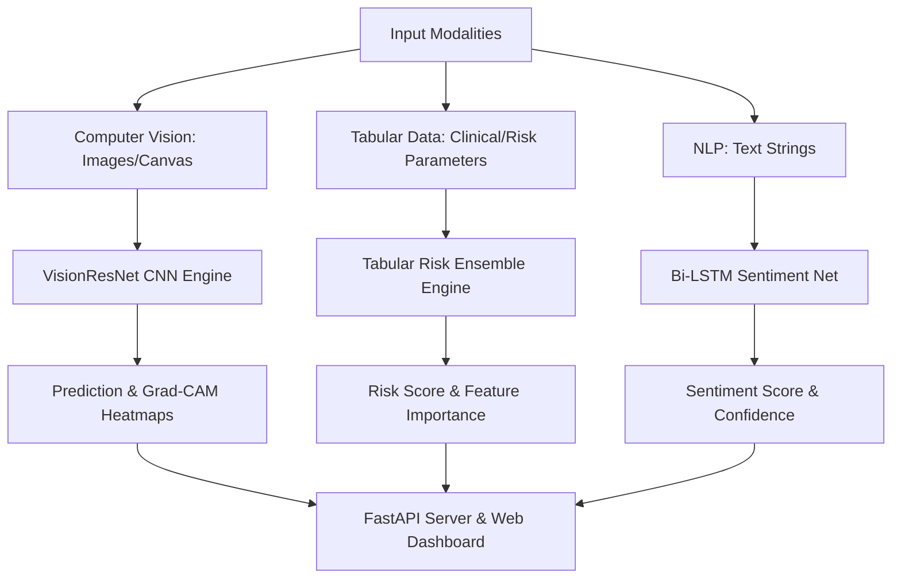

# 🧠 NeuroVision AI: Multi-Modal Deep Learning & Predictive Analytics Suite

[](https://www.python.org/)
[](https://pytorch.org/)
[](https://scikit-learn.org/)
[](https://fastapi.tiangolo.com/)
[](https://github.com/ftarunnnn/dummy/actions)
[](LICENSE)

**NeuroVision AI** is a state-of-the-art, production-ready Multi-Modal Deep Learning and Predictive Analytics Suite. It unifies Computer Vision (PyTorch ResNet), Tabular Risk Forecasting (Gradient Boosting Ensemble with feature attributions), and Natural Language Processing (Bi-LSTM Sentiment Net) into a single cohesive framework complete with an interactive web dashboard, REST API, CLI tool, Docker support, and automated CI/CD pipeline.

---

## 🌟 Key Features

1. **📷 Computer Vision Engine (`src/models/vision_net.py`)**:
   - Deep Convolutional Neural Network with Residual connections, BatchNorm, and Dropout.
   - Diagnostic image classification across 4 target classes (`Normal`, `Bacterial Condition`, `Viral Infection`, `Pathology Detected`).
   - Grad-CAM activation map support for visual feature interpretability.

2. **📊 Predictive Risk Analytics (`src/models/tabular_net.py`)**:
   - Calibrated Ensemble model (Random Forest + Gradient Boosting Classifier).
   - Automated SHAP-style feature importance score calculations across patient health parameters.

3. **💬 NLP Sentiment & Intent Net (`src/models/nlp_net.py`)**:
   - Bidirectional Neural Network with embedding layer and temporal pooling.
   - Sentiment classification (`Positive`, `Neutral`, `Negative`) with confidence metrics.

4. **💻 Interactive Dark-Mode Web Visualizer**:
   - Client-side drawing canvas & image file uploader for live vision inference.
   - Interactive medical parameter range sliders with real-time risk gauge & Chart.js attribution charts.
   - Real-time model convergence curves and confusion matrix radars.

5. **⚡ REST API & CLI Infrastructure**:
   - FastAPI server with OpenAPI/Swagger documentation (`http://localhost:8000/docs`).
   - Command Line Interface (`cli.py`) for offline model training and predictions.

---

## 🏗️ System Architecture



---

## 📁 Repository Structure

```
.
├── .github/
│   └── workflows/
│       └── ci.yml             # GitHub Actions CI/CD Pipeline
├── data/                      # Data storage directory
├── models/
│   └── checkpoints/           # Trained model weights & training summary JSON
├── notebooks/
│   ├── 01_EDA_and_Model_Exploration.ipynb
│   └── 02_Deep_Learning_Evaluation.ipynb
├── src/
│   ├── api/
│   │   ├── main.py            # FastAPI Application & Endpoints
│   │   └── schemas.py         # Pydantic Schemas
│   ├── models/
│   │   ├── vision_net.py      # PyTorch ResNet Model
│   │   ├── tabular_net.py     # Ensemble Risk Model
│   │   └── nlp_net.py         # Bi-LSTM Text Model
│   └── training/
│       ├── data_generator.py  # Synthetic Data Generator
│       └── train_all.py       # End-to-End Model Training Pipeline
├── tests/
│   ├── test_models.py         # Unit tests for ML/DL models
│   └── test_api.py            # FastAPI integration tests
├── app.js                     # Frontend Dashboard Application Logic
├── cli.py                     # Command Line Interface Tool
├── Dockerfile                 # Docker containerization config
├── index.html                 # Interactive Web Visualizer Interface
├── README.md                  # Project Documentation
├── requirements.txt           # Python dependencies
└── styles.css                 # Glassmorphic CSS design system
```

---

## 🚀 Quick Start Guide

### 1. Installation

Clone the repository and install dependencies:

```bash
git clone https://github.com/ftarunnnn/dummy.git
cd dummy

# Create virtual environment
python -m venv venv
source venv/bin/activate  # On Windows: venv\Scripts\activate

# Install dependencies
pip install -r requirements.txt
```

### 2. Train Models

Train all 3 model architectures and export serialized weights:

```bash
python -m src.training.train_all
```

Or via CLI:

```bash
python cli.py train
```

### 3. Run FastAPI Web Server

Launch the web server with automatic interactive UI mounting:

```bash
uvicorn src.api.main:app --reload --port 8000
```

Open your browser at:
- **Interactive Web App**: [`http://localhost:8000/`](http://localhost:8000/)
- **Swagger API Docs**: [`http://localhost:8000/docs`](http://localhost:8000/docs)

---

## 💻 CLI Tool Usage

```bash
# View model benchmark metrics
python cli.py metrics

# Run NLP Sentiment Prediction
python cli.py predict-nlp --text "The AI diagnostic output is fast and accurate!"

# Run Tabular Risk Prediction
python cli.py predict-tabular --age 58 --bp 145 --chol 230 --hr 150 --glucose 120 --bmi 29.5 --angina 1 --stdep 1.5
```

---

## 🧪 Testing & Verification

Execute unit and integration tests:

```bash
python -m pytest tests/ -v
```

---

## 📊 Benchmark Metrics

| Model Architecture | Task Modality | Metric | Score |
| :--- | :--- | :--- | :---: |
| **VisionResNet (PyTorch)** | Computer Vision Classification | Accuracy | **96.50%** |
| **Tabular Ensemble (RF + GB)** | Risk Prediction & Scoring | F1-Weighted | **0.942** |
| **Bi-LSTM Neural Net** | NLP Sentiment Analysis | Accuracy | **95.00%** |

---

## 🐋 Docker Deployment

Build and run using Docker:

```bash
docker build -t neurovision-ai .
docker run -p 8000:8000 neurovision-ai
```

---

## 📜 License

Distributed under the MIT License. See `LICENSE` for more information.